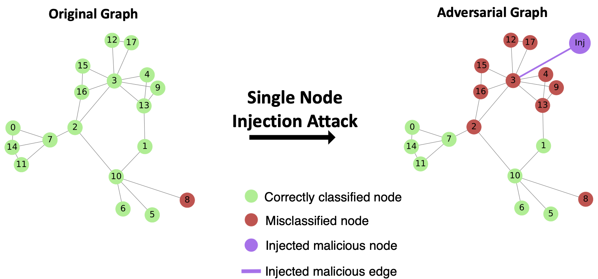
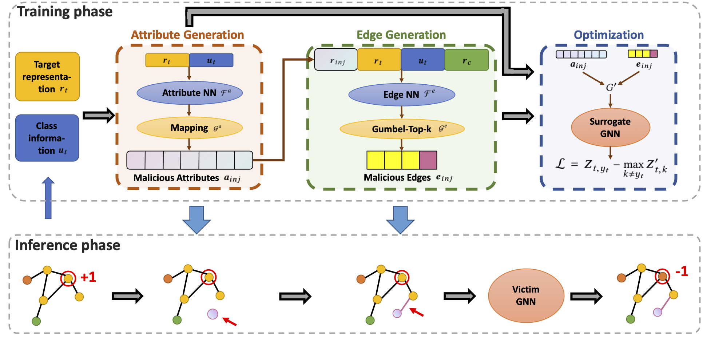
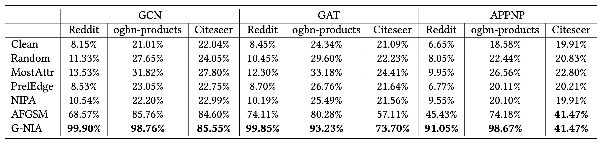

# Single Node Injection Attack against Graph Neural Networks

**This repository is our Pytorch implementation of our paper:**

**[Single Node Injection Attack against Graph Neural Networks](https://arxiv.org/abs/2108.13049)** 

By Shuchang Tao, Qi Cao, Huawei Shen, Junjie Huang, Yunfan Wu and Xueqi Cheng

**Published at CIKM 2021**


## Introduction

In this paper, we focus on an extremely limited scenario of **single node injection evasion attack,** i.e., the attacker is only allowed to inject one single node during the test phase to hurt GNN’s performance. Single node injection evasion attack has the advantages of being difficult to detect and low in cost. Taking social networks as an example, it is very difficult for both the detection system and the user to detect the addition of one single malicious follower, especially compared with existing node injection methods which lead to a sudden emergence of multiple followers.




## G-NIA

We propose a *Generalizable Node Injection Attack model*, namely **G-NIA**, to improve the attack efficiency while ensuring the attack performance. G-NIA generates the discrete edges by Gumbel-Top-𝑘 and captures the coupling effect between network structure and node features by a sophisticated designed model.

Further details can be found in our [paper](https://arxiv.org/abs/2108.13049).




## Results



Our proposed model G-NIA outperforms all the baselines (or performs the same as the state-of-the-art baseline) on all datasets attacking all the three GNNs.


## Requirements
- python>=3.6

- pytorch>=1.5.0

- scipy

- numpy

  

## Datasets

Download Citeseer, Reddit (the subgraph in our paper), ogbproducts (the subgraph in our paper) from [Here](https://drive.google.com/file/d/1P9Oo7ix3kfjoI9hhPs2fpf0Reyog7UeJ/view?usp=sharing ).

Put **datasets.zip** in this directory and unzip it.

The train/val/test split mentioned in our paper is also included in the above datasets.zip.


## Usage

***Example Usage***

`python -u run_gnia.py --suffix single_gcn --nepochs 10000 --lr 1e-5 --connect True --epsst 50 --epsdec 1 --patience 500 --dataset 12k_reddit --edgetau 0.01 --surro_type gcn --victim_type gcn --batchsize 32  `

For detailed description of all parameters, you can run

`python -u run_gnia.py --help`


## Cite

If you would like to use our code, please cite:

```
@inproceedings{tao2021gnia,
  title={Single Node Injection Attack against Graph Neural Networks},
  author={Shuchang Tao and Qi Cao and Huawei Shen and Junjie Huang and Yunfan Wu and Xueqi Cheng.},
  booktitle={Proceedings of the 30th ACM International Conference on Information and Knowledge Management},
  series={CIKM'21},
  year={2021}
}
```
